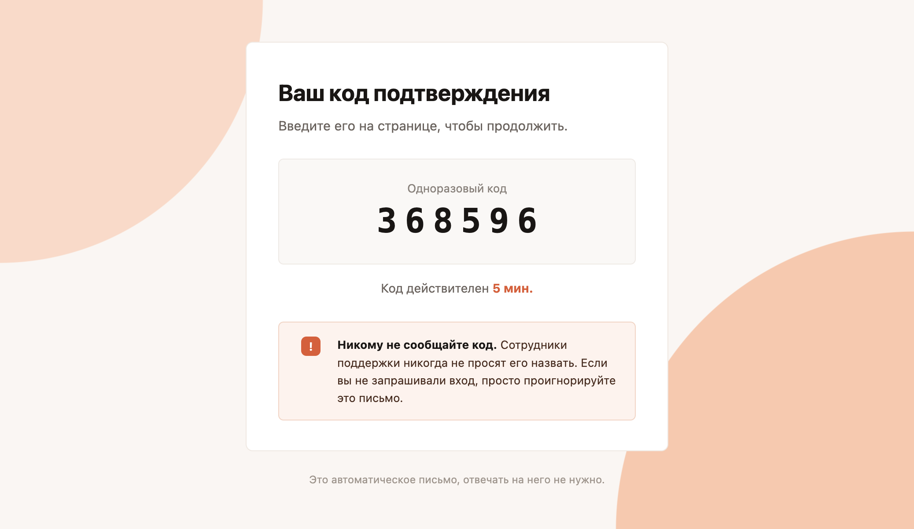

# email_verificator

Автономный сервис подтверждения email-адресов с помощью одноразовых кодов. Поставляется в виде Docker-контейнера и подключается через `docker compose`.

> ⚠️ Проект находится в разработке. Поведение может меняться.

## Как выглядит письмо

Пример письма с кодом, сроком его действия и предупреждением о безопасности:



Внешний вид письма задаётся шаблоном, см. раздел [«Шаблон письма»](#шаблон-письма).

## Возможности

- Отправка шестизначного кода подтверждения на указанный email.
- Проверка кода, введённого пользователем.
- HTML-письмо на основе шаблона.
- Код генерируется криптографически стойким генератором (модуль `secrets` из Python).
- В базе данных хранится только `SHA-256`-хэш кода, а не сам код.
- Защита от злоупотреблений: лимит на отправку кодов и лимит попыток проверки.
- Подключение через `docker-compose.yml`.
- В комплекте пример веб-интерфейса (`web_example`).

## Структура репозитория

| Путь | Описание |
| --- | --- |
| `email_verificator/` | Исходный код сервиса верификации и его `Dockerfile` |
| `web_example/` | Пример веб-клиента, работающего с сервисом |
| `docs/api_contract.md` | Подробное описание API-контракта |
| `docker-compose.yml` | Запуск сервиса и примера веб-клиента |
| `LICENSE` | Лицензия MIT |

## Настройка

Конфигурация задаётся через файл `.env` в каталоге `email_verificator/`. Шаблон лежит рядом: `email_verificator/.env.example`.

Разработка и тестирование выполнялись на Gmail.

1. Откройте `email_verificator/.env.example`.
2. В параметрах `GMAIL` и `APP_PASSWORD` укажите адрес Gmail-аккаунта и [пароль приложения](https://myaccount.google.com/apppasswords).
3. Переименуйте `.env.example` в `.env`.

### Параметры

| Параметр | Значение по умолчанию | Описание |
| --- | --- | --- |
| `GMAIL` | не задан | Адрес почты, с которой отправляются письма |
| `APP_PASSWORD` | не задан | Пароль приложения для этого аккаунта |
| `DB_PATH` | `soap.db` | Путь к файлу базы данных |
| `HOST` | `0.0.0.0` | Адрес, на котором сервис принимает запросы |
| `PORT` | `80` | Порт сервиса |
| `CODE_TTL` | `300` | Срок действия кода, секунды |
| `MAX_VERIFY_ATTEMPTS` | `5` | Максимум попыток проверки одного кода |
| `SEND_COOLDOWN` | `60` | Минимальный интервал между отправками кода на один email, секунды |
| `DB_CLEANUP_PERIOD` | `600` | Период очистки базы данных, секунды |

## Быстрый старт

Требуется установленный [Docker](https://docs.docker.com/get-docker/) с плагином Compose. Перед запуском выполните [настройку](#настройка).

```bash
git clone https://github.com/1hx74/email_verificator.git
cd email_verificator
docker compose up --build
```

После запуска будут доступны:

- **Сервис верификации**: `http://localhost:2345`
- **Веб-пример**: `http://localhost:80`

## Интеграция в свой docker compose

**1.** Склонируйте репозиторий в папку `services/email_verificator` внутри вашего проекта:

```bash
git clone https://github.com/1hx74/email_verificator.git services/email_verificator
```

**2.** Добавьте сервис в ваш `docker-compose.yml`:

```yaml
services:
  email_verificator:
    build:
      context: ./services/email_verificator
      dockerfile: email_verificator/Dockerfile
    ports:
      - "2345:2345"
```

**3.** Запустите:

```bash
docker compose up --build
```

Другие сервисы в той же сети Docker обращаются к верификатору по имени сервиса из `docker-compose.yml`: `http://email_verificator:2345`. Если сервис нужен только внутри сети Docker, уберите секцию `ports`.

Описание запросов и ответов API: [api_contract.md](api_contract.md).

## Шаблон письма

Письмо, которое приходит пользователю, генерируется из HTML-шаблона `email_verificator/verification.html`. В нём должны быть два поля-плейсхолдера:

| Поле | Что подставляется |
| --- | --- |
| `{{CODE}}` | Шестизначный код подтверждения |
| `{{TTL}}` | Срок действия кода в минутах |

Шаблон можно изменять: стили, тексты, логотип. Поля `{{CODE}}` и `{{TTL}}` должны присутствовать в шаблоне.

## Безопасность и ограничения

| Параметр | Значение по умолчанию |
| --- | --- |
| Длина кода | 6 цифр |
| Срок действия кода | 5 минут |
| Частота отправки | не чаще 1 нового кода в 60 секунд для одного email |
| Попыток проверки одного кода | 5, после этого код аннулируется |
| Хранение кода | только SHA-256 хэш |

## Лицензия

Проект распространяется под лицензией [MIT](../LICENSE).